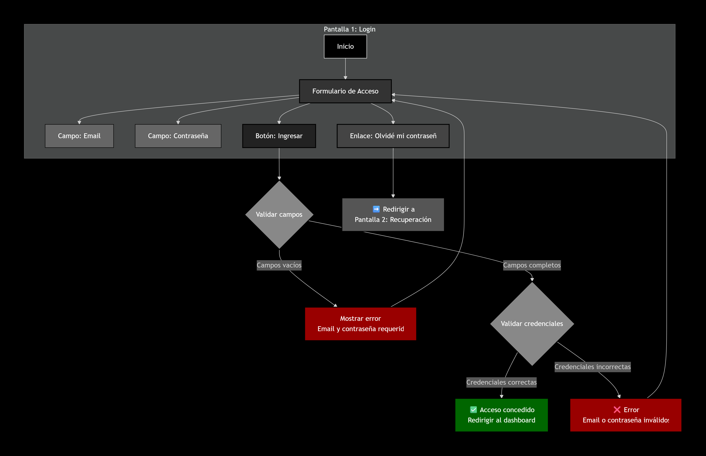

<h2> Paso Principal Login. </h2>

  
  <code>sequenceDiagram
    participant User as Usuario (Front)
    participant Front as Frontend
    participant Back as Backend (API)
    participant DB as Base de Datos

    User->>Front: Ingresa Email y Password
    Front->>+Back: POST /login {email, password}
    
    Back->>+DB: Buscar usuario por email
    DB-->>-Back: Retorna Hash de Password
    
    Note over Back: Validar Password
    
    alt Credenciales Correctas
        Back->>Back: Generar Token Original (JWT)
        Note right of Back: Inserción: Token[:4] + "qwer" + Token[4:]
        Back-->>Front: { mensaje: "Bienvenido", token: "abcdqwer..." }
        
        Note over Front: Limpieza: token.slice(0,4) + token.slice(8)
        Front->>User: Muestra Dashboard / Datos
    else Credenciales Incorrectas
        Back-->>-Front: 401 Unauthorized (Error)
        Front->>User: Mostrar "Credenciales inválidas"
    end
    </code>

